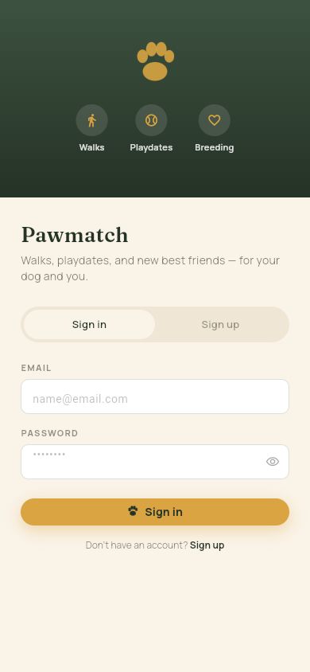
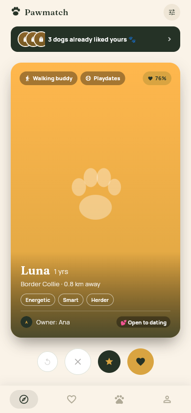
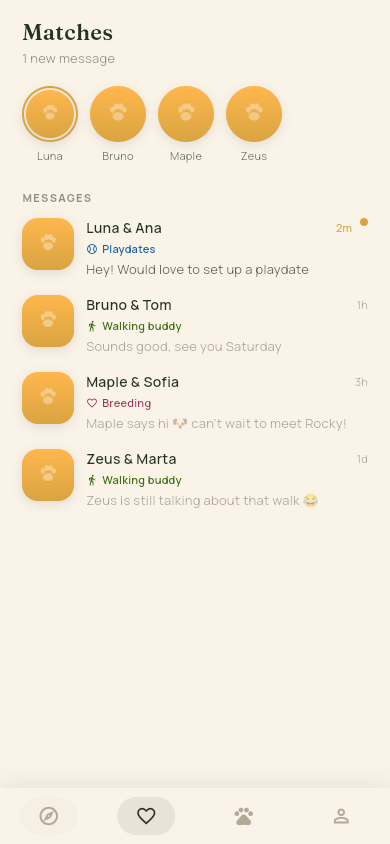
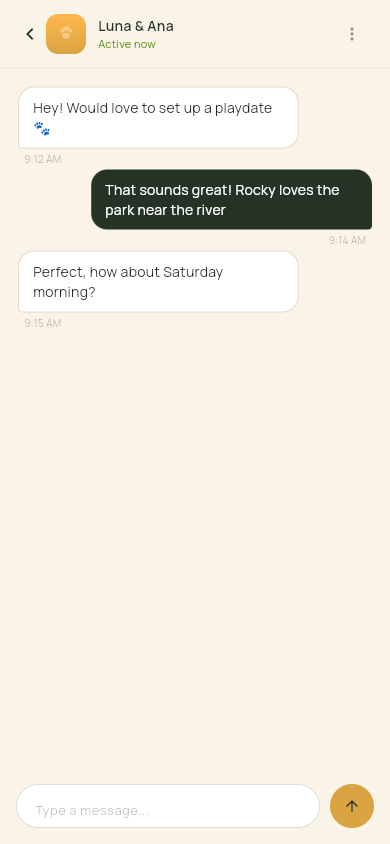
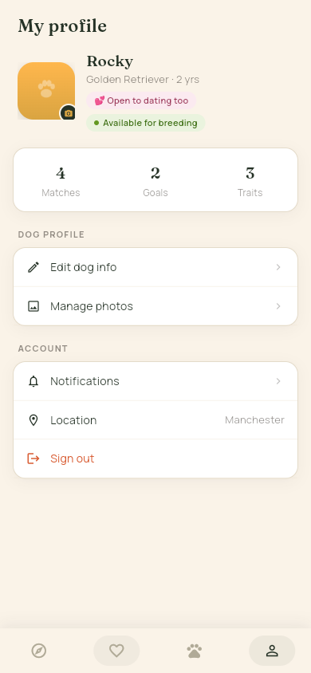

# PawMatch


A Flutter app to match dogs and their owners — for breeding, playdates, and
finding a walking buddy nearby.

## Screenshots

<table>
  <tr>
    <td align="center" width="20%">
      <br>
      Onboarding
    </td>
    <td align="center" width="20%">
      <br>
      Discover
    </td>
    <td align="center" width="20%">
      <br>
      Matches
    </td>
    <td align="center" width="20%">
      <br>
      Chat
    </td>
    <td align="center" width="20%">
      <br>
      My profile
    </td>
  </tr>
</table>

## Status

Rebuilt from scratch after the original codebase was lost. Currently runs on
mock, in-memory data (no backend calls yet); a Firebase project already
exists and is the next thing to wire up.

## Architecture

- `lib/models/` — plain data classes (`Dog`, `MatchConversation`, `ChatMessage`, `AppUser`).
- `lib/services/` — abstract repository/service interfaces plus their `Mock*`
  in-memory implementations (`DogRepository`, `MatchRepository`, `AuthService`).
  When Firebase is connected, a `Firestore*`/`FirebaseAuthService` implements
  the same interface and nothing above it has to change.
- `lib/providers/` — `ChangeNotifier`s (`AuthProvider`, `DogProvider`,
  `MatchProvider`) that call the services and expose loading/error state to
  the UI, using the [provider](https://pub.dev/packages/provider) package.
- `lib/screens/` — one file per screen, reading state from the providers via
  `context.watch`/`context.read` instead of holding local mock data.
- `lib/theme/`, `lib/widgets/` — shared colors and small reusable widgets
  (paw-print icon, bottom nav item) that used to be copy-pasted per screen.

## Getting started

```bash
flutter pub get
flutter run
```

The launcher icon is generated from `assets/icon/`; regenerate it after
changing the source image with:

```bash
dart run flutter_launcher_icons
```

To check everything still compiles and passes after making changes:

```bash
flutter analyze
flutter test
```

CI (`.github/workflows/ci.yaml`) runs both on every push and pull request
against `main`.

## Known gaps

- **No real backend yet.** Everything — auth, dogs, matches, chat — runs on
  in-memory `Mock*` implementations that reset on every app restart.
  Connecting `FirestoreDogRepository` / `FirebaseAuthService` is the next
  step; `.gitignore` already excludes the config files that step will add
  (`lib/firebase_options.dart`, `GoogleService-Info.plist`).
- **Matching is simulated.** In `MockDogRepository`/`MatchProvider`, every
  right-swipe becomes an instant match (`DogProvider.swipe` +
  `MatchProvider.addMockMatch`) since the discover queue is pre-filtered
  demo data. A real backend would only match once the other owner also
  likes back.
- **No session persistence.** Signing out or restarting the app always
  returns to onboarding — there's no local token/session cache.
- **No splash screen.** The launcher icon is set (`assets/icon/`), but
  both platforms still show Flutter's default splash on cold start.

## Contact

Built by **Lucas Martinez**. Feel free to open an issue, or reach out via the
contact info on my [GitHub profile](https://github.com/lucasmarjua-ui), if
you'd like to talk about this project.

## License

Distributed under the MIT License — see [LICENSE](LICENSE) for details.
